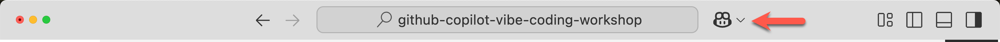
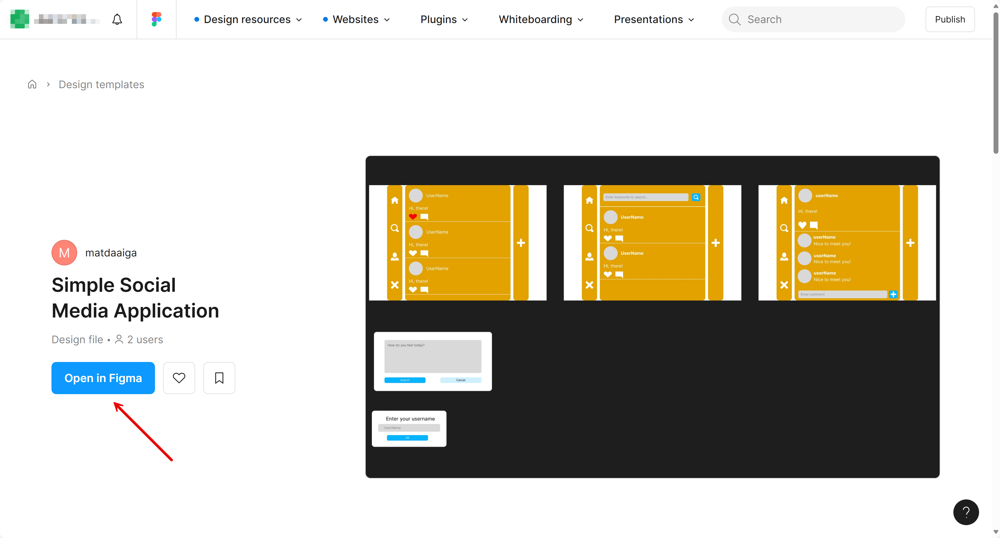

# 02: JavaScript 프론트엔드 개발

## 시나리오

Contoso는 다양한 야외 활동 제품을 판매하는 회사입니다. Contoso의 마케팅 부서는 기존 고객과 잠재 고객에게 제품을 홍보하기 위한 마이크로 소셜 미디어 웹사이트를 런칭하고자 합니다.

JavaScript 개발자로서, Python 백엔드 API 앱과 통신하는 React를 사용하여 JavaScript 프론트엔드 앱을 구축할 것입니다.

## 전제 조건

준비를 위해 [README](../README.md) 문서를 참조하세요.

## 시작하기

- [GitHub Copilot 에이전트 모드 확인](#github-copilot-에이전트-모드-확인)
- [커스텀 지시사항 준비](#커스텀-지시사항-준비)
- [애플리케이션 프로젝트 준비](#애플리케이션-프로젝트-준비)
- [Figma MCP 서버 준비](#figma-mcp-서버-준비)
- [Figma에서 UI 컴포넌트 생성](#figma에서-ui-컴포넌트-생성)
- [FastAPI 백엔드 앱 실행](#fastapi-백엔드-앱-실행)
- [React 프론트엔드 앱 구축](#react-프론트엔드-앱-구축)
- [React 프론트엔드 앱 확인](#react-프론트엔드-앱-확인)

### GitHub Copilot 에이전트 모드 확인

1. GitHub Codespace 또는 VS Code 상단의 GitHub Copilot 아이콘을 클릭하고 GitHub Copilot 창을 여세요.

   

1. 로그인 또는 가입을 요청받으면 진행하세요. 무료입니다.
1. GitHub Copilot 에이전트 모드를 사용하고 있는지 확인하세요.

   

1. 모델을 `GPT-4.1` 또는 `Claude Sonnet 4` 중 하나로 선택하세요.
1. [MCP 서버](./00-setup.md#mcp-서버-설정)를 구성했는지 확인하세요.

### 커스텀 지시사항 준비

1. `$REPOSITORY_ROOT` 환경 변수를 설정하세요.

   ```bash
   # bash/zsh
   REPOSITORY_ROOT=$(git rev-parse --show-toplevel)
   ```

   ```powershell
   # PowerShell
   $REPOSITORY_ROOT = git rev-parse --show-toplevel
   ```

1. 커스텀 지시사항을 복사하세요.

    ```bash
    # bash/zsh
    cp -r $REPOSITORY_ROOT/docs/custom-instructions/javascript/. \
          $REPOSITORY_ROOT/.github/
    ```

    ```powershell
    # PowerShell
    Copy-Item -Path $REPOSITORY_ROOT/docs/custom-instructions/javascript/* `
              -Destination $REPOSITORY_ROOT/.github/ -Recurse -Force
    ```

### 애플리케이션 프로젝트 준비

1. `Claude Sonnet 4` 또는 `GPT-4.1` 모델로 GitHub Copilot 에이전트 모드를 사용하고 있는지 확인하세요.
1. `context7` MCP 서버가 실행 중인지 확인하세요.
1. 아래와 같은 프롬프트를 사용하여 React 웹 앱 프로젝트를 스캐폴드하세요.

    ```text
    I'd like to scaffold a React web app. Follow the instructions below.
    
    - Make sure it's the web app, not the mobile app.
    - Your working directory is `javascript`.
    - Identify all the steps first, which you're going to do.
    - Use ViteJS as the frontend app framework.
    - Use default settings when initializing the project.
    - Use `SimpleSocialMediaApplication` as the name of the project while initializing.
    - Use the port number of `3000`.
    - Only initialize the project. DO NOT go further.
    ```

1. GitHub Copilot의  버튼을 클릭하여 변경사항을 적용하세요.

### Figma MCP 서버 준비

1. [MCP 서버](./00-setup.md#mcp-서버-설정)를 구성했는지 확인하세요.
1. [Figma](https://www.figma.com/)에서 개인 액세스 토큰(PAT)을 발급받으세요.
1. F1 또는 Windows에서 `Ctrl`+`Shift`+`P`, Mac OS에서 `Cmd`+`Shift`+`P`를 눌러 명령 팔레트를 열고 `MCP: List Servers`를 검색하세요.
1. `Framelink Figma MCP`를 선택한 후 `Start Server`를 클릭하세요.
1. Figma에서 발급받은 PAT를 입력하세요.

### Figma에서 UI 컴포넌트 생성

1. `Claude Sonnet 4` 또는 `GPT-4.1` 모델로 GitHub Copilot 에이전트 모드를 사용하고 있는지 확인하세요.
1. Figma MCP 서버가 실행 중인지 확인하세요.
1. [Figma 디자인 템플릿](https://www.figma.com/community/file/1495954632647006209)을 계정에 복사하세요.

   

1. 각 섹션 - `Home`, `Search`, `Post Details`, `Post Modal`, `Name Input Modal`을 마우스 우클릭 👉 `Copy/Paste as` 선택 👉 `Copy link to selection` 선택하여 각 섹션의 링크를 가져오세요. 5개 링크를 모두 메모해 두세요.

### FastAPI 백엔드 앱 실행

1. FastAPI 백엔드 앱이 실행 중인지 확인하세요.

    ```text
    Run the FastAPI backend API, which is located at the `python` directory.
    ```

   > **참고**: 대신 [`complete/python`](../complete/python/) 샘플 앱을 사용할 수도 있습니다.

1. GitHub Codespaces를 사용하는 경우, 포트 번호 `8000`이 `private` 대신 `public`으로 설정되어 있는지 확인하세요. 그렇지 않으면 프론트엔드 앱에서 접근할 때 `401` 오류가 발생합니다.

### React 프론트엔드 앱 구축

1. `Claude Sonnet 4` 또는 `GPT-4.1` 모델로 GitHub Copilot 에이전트 모드를 사용하고 있는지 확인하세요.
1. `context7` MCP 서버가 실행 중인지 확인하세요.
1. [이전 섹션](#figma에서-ui-컴포넌트-생성)에서 가져온 5개의 Figma 섹션 링크를 모두 보유하고 있는지 확인하세요.
1. [`product-requirements.md`](../product-requirements.md)와 [`openapi.yaml`](../openapi.yaml)를 GitHub Copilot에 추가하세요.
1. 요구사항과 OpenAPI 문서를 기반으로 애플리케이션을 구축하기 위해 아래와 같은 프롬프트를 사용하세요.

    ```text
    I'd like to build a React web app. Follow the instructions below.
    
    - Your working directory is `javascript`.
    - Identify all the steps first, which you're going to do.
    - There's a backend API app running on `http://localhost:8000`.
    - Use `openapi.yaml` that describes all the endpoints and data schema.
    - Use the port number of `3000`.
    - Create all the UI components defined in this link: {{FIGMA_SECTION_LINK}}.
    - DO NOT add anything not related to the UI components.
    - DO NOT add anything not defined in `openapi.yaml`.
    - DO NOT modify anything defined in `openapi.yaml`.
    - Give visual indication when the backend API is unavailable or unreachable for any reason.
    ```

1. 나머지 4개의 Figma 디자인 링크에 대해 4번 더 반복하세요.
1. GitHub Copilot의  버튼을 클릭하여 변경사항을 적용하세요.

### React 프론트엔드 앱 확인

1. FastAPI 백엔드 앱이 실행 중인지 확인하세요.

    ```text
    Run the FastAPI backend API, which is located at the `python` directory.
    ```

1. 제대로 빌드되었는지 확인하세요.

    ```text
    Run the React app and verify if the app is properly running.

    If app running fails, analyze the issues and fix them.
    ```

1. 웹 브라우저를 열고 `http://localhost:3000`으로 이동하세요.
1. 프론트엔드와 백엔드 앱이 모두 제대로 실행되는지 확인하세요.
1. GitHub Copilot의 `[keep]` 버튼을 클릭하여 변경사항을 적용하세요.

---

좋습니다. "JavaScript" 단계를 완료했습니다. [STEP 03: Python에서 Java로 마이그레이션](./03-java.md)로 이동하겠습니다.