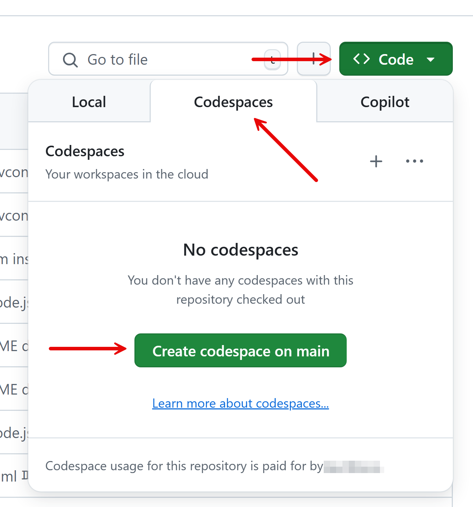

# 00: 开发环境

在此步骤中，您将为工作坊设置开发环境。

## 先决条件

请参考 [README](../../README.md) 文档进行准备。

## 入门

- [使用 GitHub Codespaces](#使用-github-codespaces)
- [使用 Visual Studio Code](#使用-visual-studio-code)
  - [安装 PowerShell 👉 Windows 用户](#安装-powershell--windows-用户)
  - [安装 git CLI](#安装-git-cli)
  - [安装 GitHub CLI](#安装-github-cli)
  - [安装 Docker Desktop](#安装-docker-desktop)
  - [安装 Visual Studio Code](#安装-visual-studio-code)
  - [启动 Visual Studio Code](#启动-visual-studio-code)
- [检查 GitHub Copilot 代理模式](#检查-github-copilot-代理模式)
- [准备自定义说明](#准备自定义说明)
- [分析产品需求文档 (PRD) 并设计 API](#分析产品需求文档-prd-并设计-api)

## 使用 GitHub Codespaces

1. 查看下面的图片，按照以下顺序点击： 👉  👉  并创建一个新的 GitHub Codespace 实例。根据网络状态可能需要 5-10 分钟。

   

2. GitHub Codespace 实例准备就绪后，打开终端并运行以下命令来检查您需要的所有内容是否已正确安装。

    ```bash
    # Python
    python --version
    ```

    ```bash
    # Node.js
    node --version
    npm --version

    ```

    ```bash
    # JDK
    java --version
    ```

    ```bash
    # .NET SDK
    dotnet --list-sdks
    ```

3. 检查您的存储库状态。

    ```bash
    git remote -v
    ```

   您应该能看到以下内容。

    ```bash
    origin  https://github.com/microsoft/github-copilot-vibe-coding-workshop.git (fetch)
    origin  https://github.com/microsoft/github-copilot-vibe-coding-workshop.git (push)
    ```

   如果您看到的内容与上述不同，请删除 GitHub Codespace 实例并重新创建。

4. 移动到 [设置 MCP 服务器](#设置-mcp-服务器) 部分。

**👇👇👇 如果您想在本地机器上使用 VS Code，请按照下面的说明操作。下面的部分不适用于使用 GitHub Codespaces 的用户。 👇👇👇**

## 使用 Visual Studio Code

### 安装 PowerShell 👉 Windows 用户

1. 检查您是否已安装 PowerShell。

    ```bash
    # Bash/Zsh
    which pwsh
    ```

    ```bash
    # PowerShell
    Get-Command pwsh
    ```

   如果您没有看到 `pwsh` 的命令路径，说明您尚未安装 PowerShell。请访问 [PowerShell 安装页面](https://learn.microsoft.com/powershell/scripting/install/installing-powershell) 并按照说明操作。

2. 检查您的 PowerShell 版本。

    ```bash
    pwsh --version
    ```

   推荐 `7.5.0` 或更高版本。如果您的版本低于该版本，请访问 [PowerShell 安装页面](https://learn.microsoft.com/powershell/scripting/install/installing-powershell) 并按照说明操作。

### 安装 git CLI

1. 检查您是否已安装 git CLI。

    ```bash
    # Bash/Zsh
    which git
    ```

    ```bash
    # PowerShell
    Get-Command git
    ```

   如果您没有看到 `git` 的命令路径，说明您尚未安装 git CLI。请访问 [git CLI 安装页面](https://git-scm.com/downloads) 并按照说明操作。

2. 检查您的 git CLI 版本。

    ```bash
    git --version
    ```

   推荐 `2.39.0` 或更高版本。如果您的版本低于该版本，请访问 [git CLI 安装页面](https://git-scm.com/downloads) 并按照说明操作。

### 安装 GitHub CLI

1. 检查您是否已安装 GitHub CLI。

    ```bash
    # Bash/Zsh
    which gh
    ```

    ```bash
    # PowerShell
    Get-Command gh
    ```

   如果您没有看到 `gh` 的命令路径，说明您尚未安装 GitHub CLI。请访问 [GitHub CLI 安装页面](https://cli.github.com/) 并按照说明操作。

2. 检查您的 GitHub CLI 版本。

    ```bash
    gh --version
    ```

   推荐 `2.65.0` 或更高版本。如果您的版本低于该版本，请访问 [GitHub CLI 安装页面](https://cli.github.com/) 并按照说明操作。

3. 检查您是否已登录 GitHub。

    ```bash
    gh auth status
    ```

   如果您尚未登录，请运行 `gh auth login` 并登录。

### 安装 Docker Desktop

1. 检查您是否已安装 Docker Desktop。

    ```bash
    # Bash/Zsh
    which docker
    ```

    ```bash
    # PowerShell
    Get-Command docker
    ```

   如果您没有看到 `docker` 的命令路径，说明您尚未安装 Docker Desktop。请访问 [Docker Desktop 安装页面](https://docs.docker.com/get-started/introduction/get-docker-desktop/) 并按照说明操作。

2. 检查您的 Docker Desktop 版本。

    ```bash
    docker --version
    ```

   推荐 `27.1.0` 或更高版本。如果您的版本低于该版本，请访问 [Docker Desktop 安装页面](https://docs.docker.com/get-started/introduction/get-docker-desktop/) 并按照说明操作。

### 安装 Visual Studio Code

1. 检查您是否已安装 Visual Studio Code。

    ```bash
    # Bash/Zsh
    which code
    ```

    ```bash
    # PowerShell
    Get-Command code
    ```

   如果您没有看到 `code` 的命令路径，说明您尚未安装 Visual Studio Code。请访问 [Visual Studio Code 安装页面](https://code.visualstudio.com/) 并按照说明操作。

2. 检查您的 Visual Studio Code 版本。

    ```bash
    code --version
    ```

   推荐 `1.95.0` 或更高版本。如果您的版本低于该版本，请访问 [Visual Studio Code 安装页面](https://code.visualstudio.com/) 并按照说明操作。

### 启动 Visual Studio Code

1. 对于那些刚刚安装 Visual Studio Code 或第一次运行的用户，请运行以下命令：

    ```bash
    code --install-extension "github.copilot" --force && code --install-extension "github.copilot-chat" --force
    ```

2. 对于已经运行过 Visual Studio Code 的用户，您可以跳过上面的步骤。

3. 通过运行以下命令来 fork 此存储库：

    ```bash
    gh repo fork microsoft/github-copilot-vibe-coding-workshop --clone=true
    ```

4. 将目录更改为您刚刚克隆的存储库：

    ```bash
    cd github-copilot-vibe-coding-workshop
    ```

5. 检查您的存储库状态。

    ```bash
    git remote -v
    ```

   您应该能看到以下内容。如果您在 `origin` 中看到 `microsoft`，则需要从您的 fork 存储库重新克隆。

    ```bash
    origin  https://github.com/<your GitHub ID>/github-copilot-vibe-coding-workshop.git (fetch)
    origin  https://github.com/<your GitHub ID>/github-copilot-vibe-coding-workshop.git (push)
    upstream        https://github.com/microsoft/github-copilot-vibe-coding-workshop.git (fetch)
    upstream        https://github.com/microsoft/github-copilot-vibe-coding-workshop.git (push)
    ```

6. 在 Visual Studio Code 中打开存储库。

    ```bash
    code .
    ```

## 检查 GitHub Copilot 代理模式

一旦 Visual Studio Code 启动，请确保 GitHub Copilot 代理模式已启用。

1. 点击 Visual Studio Code 的底部栏上的 GitHub Copilot 图标。

   

2. 在聊天窗口中，输入 `@workspace` 并按 `Enter` 键。

   

3. 输入任何提示，例如 `Can you help me understand the structure of this repository?`，然后按 `Enter` 键。

   

如果您看到类似下图的回复，说明 GitHub Copilot 代理模式工作正常。

   

## 准备自定义说明

1. 设置 `$REPOSITORY_ROOT` 环境变量。

   ```bash
   # bash/zsh
   REPOSITORY_ROOT=$(git rev-parse --show-toplevel)
   ```

   ```powershell
   # PowerShell
   $REPOSITORY_ROOT = git rev-parse --show-toplevel
   ```

2. 复制自定义说明。

    ```bash
    # bash/zsh
    cp -r $REPOSITORY_ROOT/docs/custom-instructions/setup/. \
          $REPOSITORY_ROOT/.github/
    ```

    ```powershell
    # PowerShell
    Copy-Item -Path $REPOSITORY_ROOT/docs/custom-instructions/setup/* `
              -Destination $REPOSITORY_ROOT/.github/ -Recurse -Force
    ```

3. 验证复制是否成功。

    ```bash
    # bash/zsh
    ls -la $REPOSITORY_ROOT/.github/
    ```

    ```powershell
    # PowerShell
    Get-ChildItem -Path $REPOSITORY_ROOT/.github/ -Force
    ```

   您应该能看到 `copilot-instructions.md` 文件在您的 `.github` 目录中。

## 设置 MCP 服务器

1. 设置 `$REPOSITORY_ROOT` 环境变量。

   ```bash
   # bash/zsh
   REPOSITORY_ROOT=$(git rev-parse --show-toplevel)
   ```

   ```powershell
   # PowerShell
   $REPOSITORY_ROOT = git rev-parse --show-toplevel
   ```

2. 复制 MCP 服务器设置。

    ```bash
    # bash/zsh
    cp -r $REPOSITORY_ROOT/docs/.vscode/. \
          $REPOSITORY_ROOT/.vscode/
    ```

    ```powershell
    # PowerShell
    Copy-Item -Path $REPOSITORY_ROOT/docs/.vscode/* `
              -Destination $REPOSITORY_ROOT/.vscode/ -Recurse -Force
    ```

3. 验证复制是否成功。

    ```bash
    # bash/zsh
    ls -la $REPOSITORY_ROOT/.vscode/
    ```

    ```powershell
    # PowerShell
    Get-ChildItem -Path $REPOSITORY_ROOT/.vscode/ -Force
    ```

   您应该能看到 `settings.json` 文件在您的 `.vscode` 目录中。

4. 重新启动 Visual Studio Code 以应用新的 MCP 服务器设置。

   

5. 在 GitHub Copilot 聊天窗口中，您现在应该能看到 `@file-search` 代理。尝试输入提示，例如 `@file-search please find all files that include the word "agent"`。

   

## 分析产品需求文档 (PRD) 并设计 API

现在让我们分析 [产品需求文档 (PRD)](../../product-requirements.md) 并设计 API。

1. 在 Visual Studio Code 中打开产品需求文档。

    ```bash
    code $REPOSITORY_ROOT/product-requirements.md
    ```

2. 在 GitHub Copilot 聊天窗口中，输入以下提示。确保您使用 `@workspace` 代理：

    ```
    @workspace Please review the PRD and generate a simple OpenAPI 3.0.1 specification YAML file for the social media API. The spec should include all endpoints mentioned in the PRD. Make sure to include:

    1. All the endpoints for posts (CRUD operations)
    2. All the endpoints for comments (CRUD operations)  
    3. Like/unlike endpoints
    4. Proper request/response schemas
    5. HTTP status codes
    6. Content-Type as application/json

    Save it as `/openapi.yaml` at the repository root.
    ```

3. GitHub Copilot 应该分析 PRD 并在存储库根目录生成一个 OpenAPI 规范文件。验证是否创建了文件。

    ```bash
    ls -la $REPOSITORY_ROOT/openapi.yaml
    ```

现在您已准备好开始构建应用程序了！

---

## 下一步

移动到 [01: Python](./01-python.md) 开始构建 Python 后端应用程序。