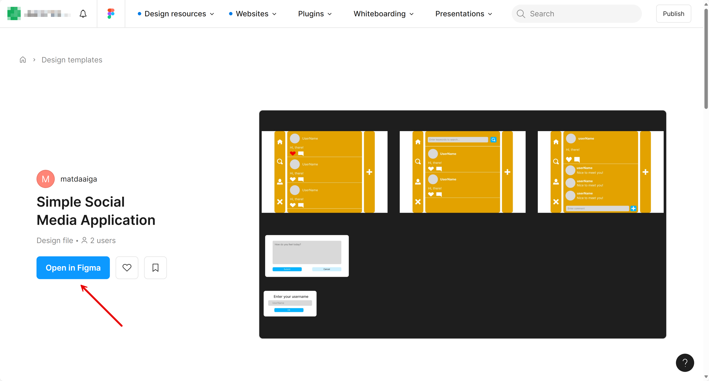

# 02: JavaScript 前端开发

## 场景

Contoso 是一家销售各种户外活动产品的公司。Contoso 的市场部门希望启动一个微型社交媒体网站，为现有和潜在客户推广他们的产品。

作为 JavaScript 开发人员，您将使用 React 构建与 Python 后端 API 应用程序通信的 JavaScript 前端应用程序。

## 先决条件

请参考 [README](../../README.md) 文档进行准备。

## 入门

- [检查 GitHub Copilot 代理模式](#检查-github-copilot-代理模式)
- [准备自定义说明](#准备自定义说明)
- [准备应用程序项目](#准备应用程序项目)
- [准备 Figma MCP 服务器](#准备-figma-mcp-服务器)
- [从 Figma 生成 UI 组件](#从-figma-生成-ui-组件)
- [运行 FastAPI 后端应用程序](#运行-fastapi-后端应用程序)
- [构建 React 前端应用程序](#构建-react-前端应用程序)
- [验证 React 前端应用程序](#验证-react-前端应用程序)

### 检查 GitHub Copilot 代理模式

1. 点击 GitHub Codespace 或 VS Code 顶部的 GitHub Copilot 图标，打开 GitHub Copilot 窗口。

   

2. 如果系统要求您登录或注册，请执行此操作。这是免费的。
3. 确保您使用的是 GitHub Copilot 代理模式。

   

4. 选择模型为 `GPT-4.1` 或 `Claude Sonnet 4`。
5. 确保您已配置 [MCP 服务器](./00-setup.md#设置-mcp-服务器)。

### 准备自定义说明

1. 设置 `$REPOSITORY_ROOT` 环境变量。

   ```bash
   # bash/zsh
   REPOSITORY_ROOT=$(git rev-parse --show-toplevel)
   ```

   ```powershell
   # PowerShell
   $REPOSITORY_ROOT = git rev-parse --show-toplevel
   ```

2. 复制自定义说明。

    ```bash
    # bash/zsh
    cp -r $REPOSITORY_ROOT/docs/custom-instructions/javascript/. \
          $REPOSITORY_ROOT/.github/
    ```

    ```powershell
    # PowerShell
    Copy-Item -Path $REPOSITORY_ROOT/docs/custom-instructions/javascript/* `
              -Destination $REPOSITORY_ROOT/.github/ -Recurse -Force
    ```

### 准备应用程序项目

1. 确保您使用的是 GitHub Copilot 代理模式，模型为 `Claude Sonnet 4` 或 `GPT-4.1`。
2. 确保 `context7` MCP 服务器正在运行。
3. 使用如下提示来构建 React Web 应用程序项目。

    ```text
    I'd like to scaffold a React web app. Follow the instructions below.
    
    - Make sure it's the web app, not the mobile app.
    - Your working directory is `javascript`.
    - Identify all the steps first, which you're going to do.
    - Use ViteJS as the frontend app framework.
    - Use default settings when initializing the project.
    - Use `SimpleSocialMediaApplication` as the name of the project while initializing.
    - Use the port number of `3000`.
    - Only initialize the project. DO NOT go further.
    ```

4. 点击 GitHub Copilot 的  按钮以接受更改。

### 准备 Figma MCP 服务器

1. 确保您已配置 [MCP 服务器](./00-setup.md#设置-mcp-服务器)。
2. 从 [Figma](https://www.figma.com/) 获取个人访问令牌 (PAT)。
3. 按 F1 或在 Windows 上按 `Ctrl`+`Shift`+`P` 或在 Mac OS 上按 `Cmd`+`Shift`+`P` 打开命令面板，然后搜索 `MCP: List Servers`。
4. 选择 `Framelink Figma MCP`，然后点击 `Start Server`。
5. 输入您从 Figma 获得的 PAT。

### 从 Figma 生成 UI 组件

1. 确保您使用的是 GitHub Copilot 代理模式，模型为 `Claude Sonnet 4` 或 `GPT-4.1`。
2. 确保您正在运行 Figma MCP 服务器。
3. 将 [Figma 设计模板](https://www.figma.com/community/file/1495954632647006209) 复制到您的账户。

   

4. 右键点击每个部分 - `Home`、`Search`、`Post Details`、`Post Modal` 和 `Name Input Modal` 👉 选择 `Copy/Paste as` 👉 选择 `Copy link to selection` 以获取每个部分的链接。记下所有五个链接。

### 运行 FastAPI 后端应用程序

1. 确保 FastAPI 后端应用程序正在运行。

    ```text
    Run the FastAPI backend API, which is located at the `python` directory.
    ```

   > **注意**: 您可以使用 [`complete/python`](../../complete/python/) 示例应用程序。

2. 如果您使用 GitHub Codespaces，请确保端口号 `8000` 设置为 `public` 而不是 `private`。否则，从前端应用程序访问时会出现 `401` 错误。

### 构建 React 前端应用程序

1. 确保您使用的是 GitHub Copilot 代理模式，模型为 `Claude Sonnet 4` 或 `GPT-4.1`。
2. 确保 `context7` MCP 服务器正在运行。
3. 确保您拥有从[上一节](#从-figma-生成-ui-组件)检索到的所有 5 个 Figma 部分链接。
4. 将 [`product-requirements.md`](../../product-requirements.md) 和 [`openapi.yaml`](../openapi.yaml) 添加到 GitHub Copilot。
5. 使用如下提示来根据需求和 OpenAPI 文档构建应用程序。

    ```text
    I'd like to build a React web app. Follow the instructions below.
    
    - Your working directory is `javascript`.
    - Identify all the steps first, which you're going to do.
    - There's a backend API app running on `http://localhost:8000`.
    - Use `openapi.yaml` that describes all the endpoints and data schema.
    - Use the port number of `3000`.
    - Create all the UI components defined in this link: {{FIGMA_SECTION_LINK}}.
    - DO NOT add anything not related to the UI components.
    - DO NOT add anything not defined in `openapi.yaml`.
    - DO NOT modify anything defined in `openapi.yaml`.
    - Give visual indication when the backend API is unavailable or unreachable for any reason.
    ```

6. 对其余四个 Figma 设计链接重复四次。
7. 点击 GitHub Copilot 的  按钮以接受更改。

### 验证 React 前端应用程序

1. 确保 FastAPI 后端应用程序正在运行。

    ```text
    Run the FastAPI backend API, which is located at the `python` directory.
    ```

2. 验证其是否正确构建。

    ```text
    Run the React app and verify if the app is properly running.

    If app running fails, analyze the issues and fix them.
    ```

3. 打开网页浏览器并导航到 `http://localhost:3000`。
4. 验证前端和后端应用程序是否都正常运行。
5. 点击 GitHub Copilot 的 `[keep]` 按钮以接受更改。

---

好的。您已完成"JavaScript"步骤。让我们继续进行 [步骤 03: 从 Python 迁移到 Java](./03-java.md)。